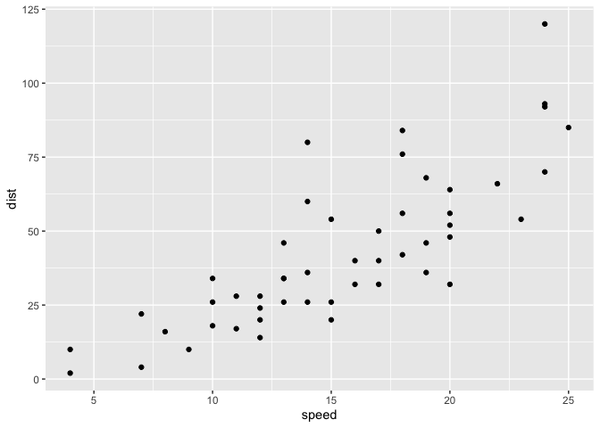
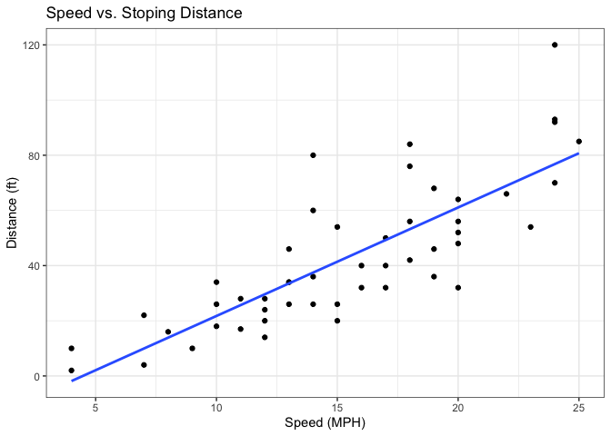
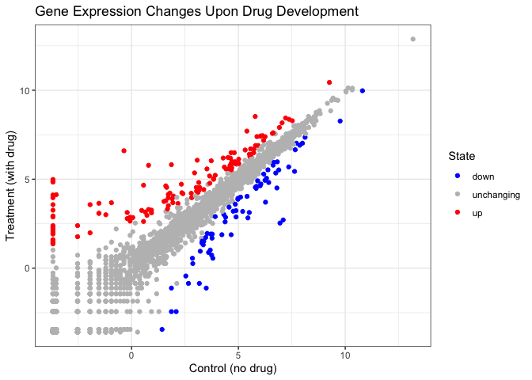
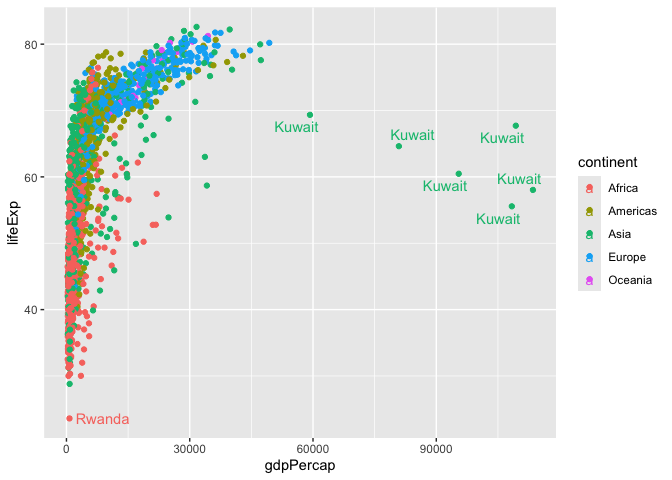

# Class 5: Data Vis with Ggplot
Laura Sun (PID: A17923552)

Today we are exploring **ggplot** package and how to make nice figures
in R.

There are lots of ways to make figures and plots in R. These include:

- “base” R
- add on packages like **ggplot2**

Here is a simple “base” R plot. Add code chunk by +C then R.

``` r
head(cars)
```

      speed dist
    1     4    2
    2     4   10
    3     7    4
    4     7   22
    5     8   16
    6     9   10

We can simply pass it to the `plot()` function.

``` r
plot(cars)
```


> Key-point: Base R is quick but not so nice looking in some folks eyes

Let’s see how we can plot this with **ggplot2**…

First, instal this add-on package. For this we use the
`install.packages()` function. **We do this in the console to save time,
not our report** This is one time only.

Second, load the package with the `library()` function every time we
want to use it.

``` r
library(ggplot2)
ggplot(cars)
```


Every ggplot is composed of at least 3 layers: \_ **Data** (e.g. a
dataframe with the things you want to do) - Data aesthetics **aes()**
maps the columns of data to your plot features \_ geoms like
**geom_point()** that srt how the plot appears

``` r
ggplot(cars) + aes(x=speed, y=dist) + geom_point()
```



``` r
hist(cars$speed)
```


> key_point: or simple “canned” graphs base R is quick and more concise.
> As things get more custom and elaborate them theen ggplot will win.

Add more layers!

Add a line to show relationship between X and Y. Add a title Add custom
axis labels “Speed (MPH)” and “Distance (ft)”

``` r
ggplot(cars) + aes(x=speed, y=dist) + geom_point() + 
  geom_smooth(method="lm", se=FALSE) + 
  labs(title = "Speed vs. Stoping Distance", 
       x = "Speed (MPH)", y = "Distance (ft)") + theme_bw()
```

    `geom_smooth()` using formula = 'y ~ x'



## Going further

Read some gene expression data

``` r
url <- "https://bioboot.github.io/bimm143_S20/class-material/up_down_expression.txt"
genes <- read.delim(url)
head(genes)
```

            Gene Condition1 Condition2      State
    1      A4GNT -3.6808610 -3.4401355 unchanging
    2       AAAS  4.5479580  4.3864126 unchanging
    3      AASDH  3.7190695  3.4787276 unchanging
    4       AATF  5.0784720  5.0151916 unchanging
    5       AATK  0.4711421  0.5598642 unchanging
    6 AB015752.4 -3.6808610 -3.5921390 unchanging

> Q1: How many genes are in this data set?

``` r
nrow(genes)
```

    [1] 5196

``` r
ncol(genes)
```

    [1] 4

> Q2: How many “up” related genes are there?

nrow(genes\$State==“up”) gives Null. nrow expects a matrix, not a
logical vector.

``` r
sum(genes$State=="up")
```

    [1] 127

A useful function for counting up occurrences of things in a vector is
the `tables()` function.

``` r
table(genes$State)
```


          down unchanging         up 
            72       4997        127 

``` r
p <- ggplot(data=genes) + aes(x=Condition1, y=Condition2, col = State) + geom_point()

p + scale_color_manual(values=c("blue", "grey", "red")) +
  labs(title="Gene Expression Changes Upon Drug Development", 
       x="Control (no drug)", y="Treatment (with drug)") + 
  theme_bw()
```



## More Plotting

Read in the gap minder data set.

``` r
url <- "https://raw.githubusercontent.com/jennybc/gapminder/master/inst/extdata/gapminder.tsv"

gapminder <- read.delim(url)
```

Let’s have a peak.

``` r
tail(gapminder,3)
```

          country continent year lifeExp      pop gdpPercap
    1702 Zimbabwe    Africa 1997  46.809 11404948  792.4500
    1703 Zimbabwe    Africa 2002  39.989 11926563  672.0386
    1704 Zimbabwe    Africa 2007  43.487 12311143  469.7093

> Q4: How many different countries are in this data set?

``` r
length(table(gapminder$country))
```

    [1] 142

> Q5: How many different continents are in this data set?

``` r
length(table(gapminder$continent))
```

    [1] 5

``` r
unique(gapminder$continent)
```

    [1] "Asia"     "Europe"   "Africa"   "Americas" "Oceania" 

``` r
ggplot(data=gapminder) + aes(x=gdpPercap, y=lifeExp, col=continent) + geom_point()
```


To add the names…

``` r
ggplot(data=gapminder) + aes(x=gdpPercap, y=lifeExp, col=continent, label=country) + geom_point() + geom_text()
```


Use **ggrepel** to make more sensible labels here. Add on package
install.packages(“ggrepel”) in the console.

``` r
library(ggrepel)
ggplot(data=gapminder) + 
  aes(x=gdpPercap, y=lifeExp, col=continent, label=country) + 
  geom_point() + geom_text_repel()
```

    Warning: ggrepel: 1697 unlabeled data points (too many overlaps). Consider
    increasing max.overlaps



I want a separate panel for each continent.

``` r
ggplot(data=gapminder) + aes(x=gdpPercap, y=lifeExp, col=continent, label=country) + 
  geom_point() + facet_wrap(~continent)
```


## Summary

ggplot2 offers several main advantages over base R graphics:

1.  Layered grammar: ggplot2 uses a consistent, layered approach (data +
    aesthetics + geometry) for building plots, making it easier to
    create complex, publication-quality figures by adding layers
    step-by-step
    [\[5\]](https://drive.google.com/file/d/19AkbGsbG0Rc8Nn_6wdQ8Fi_OFV9vcMIx/view?usp=drivesdk),
    [\[6\]](https://drive.google.com/file/d/15xXaaIcCWOc_x1gJLdySWOd_sfMXTiaw/view?usp=drivesdk).

2.  Declarative syntax: You specify what you want to see (mapping data
    to aesthetics), rather than how to draw each element, which is more
    intuitive and less fiddly than base R
    [\[1\]](https://drive.google.com/file/d/1BYSWJLROqxA1YpuDhJkzUolhiZqiOOKg/view?usp=drivesdk),
    [\[3\]](https://drive.google.com/file/d/1tFqKg9_nhVMmKYfiM1CQKDS2PmPwLh8n/view?usp=drivesdk),
    [\[6\]](https://drive.google.com/file/d/15xXaaIcCWOc_x1gJLdySWOd_sfMXTiaw/view?usp=drivesdk).

3.  Sensible defaults: ggplot2 provides attractive default themes and
    legends, so plots look good with minimal effort, while base R often
    requires more manual tweaking for aesthetics
    [\[1\]](https://drive.google.com/file/d/1BYSWJLROqxA1YpuDhJkzUolhiZqiOOKg/view?usp=drivesdk),
    [\[3\]](https://drive.google.com/file/d/1tFqKg9_nhVMmKYfiM1CQKDS2PmPwLh8n/view?usp=drivesdk).

4.  Customization: It is easier to customize and extend plots in
    ggplot2, especially for adding color, labels, themes, and other
    features
    [\[3\]](https://drive.google.com/file/d/1tFqKg9_nhVMmKYfiM1CQKDS2PmPwLh8n/view?usp=drivesdk),
    [\[6\]](https://drive.google.com/file/d/15xXaaIcCWOc_x1gJLdySWOd_sfMXTiaw/view?usp=drivesdk).

5.  Consistency: The same building blocks are used for all plot types,
    reducing the need to learn many different functions as in base R
    [\[5\]](https://drive.google.com/file/d/19AkbGsbG0Rc8Nn_6wdQ8Fi_OFV9vcMIx/view?usp=drivesdk),
    [\[6\]](https://drive.google.com/file/d/15xXaaIcCWOc_x1gJLdySWOd_sfMXTiaw/view?usp=drivesdk).

6.  Reproducibility: ggplot2 code is more modular and scriptable, making
    it easier to reproduce and update figures
    [\[1\]](https://drive.google.com/file/d/1BYSWJLROqxA1YpuDhJkzUolhiZqiOOKg/view?usp=drivesdk),
    [\[3\]](https://drive.google.com/file/d/1tFqKg9_nhVMmKYfiM1CQKDS2PmPwLh8n/view?usp=drivesdk).

Do you have questions about any of these advantages?
