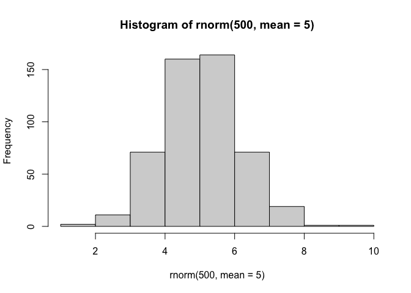
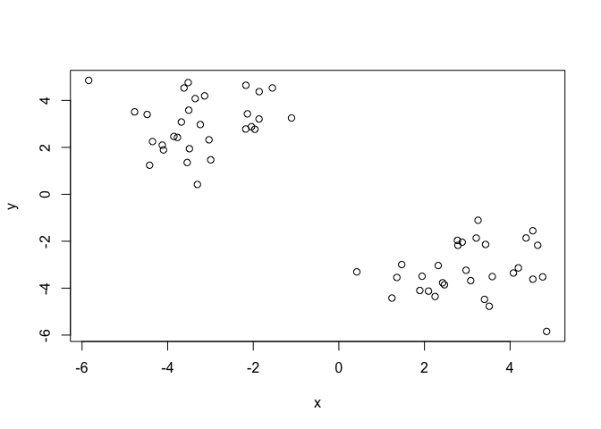
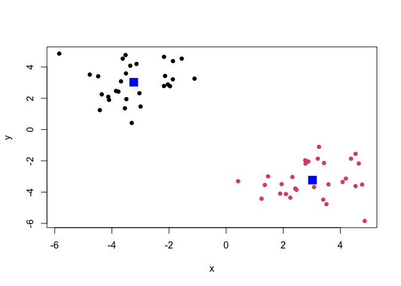
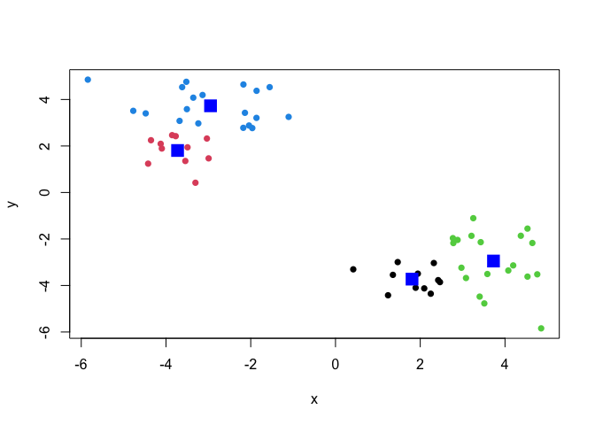
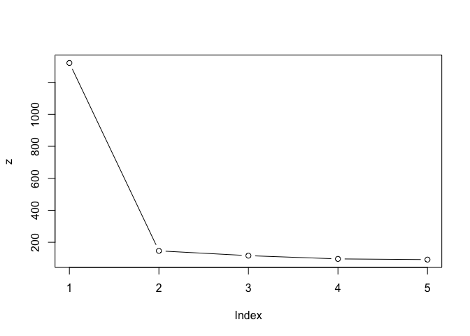
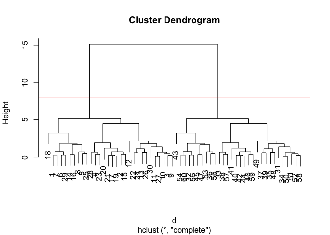
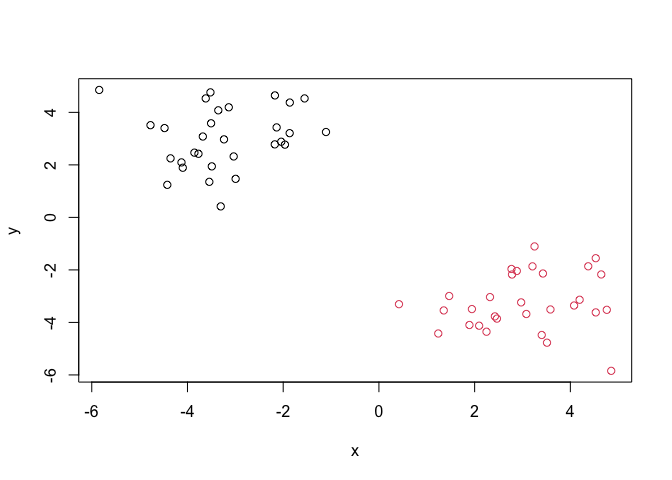
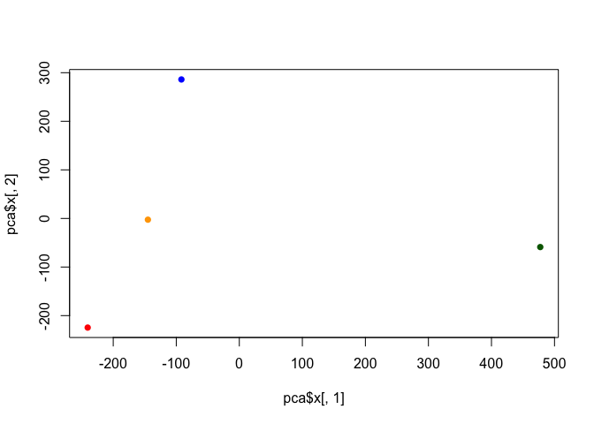
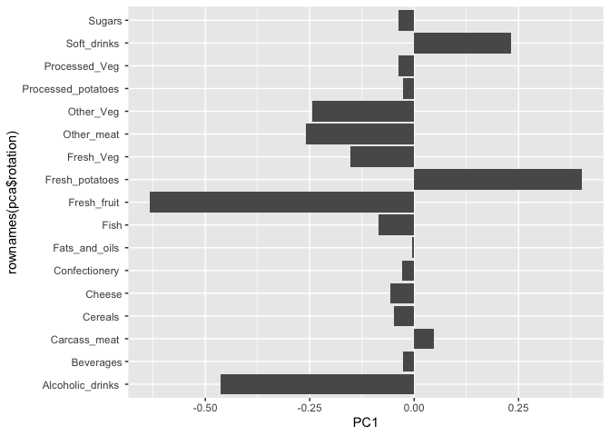

# Class07: Machine Learning 1
Laura Sun (A17923552)

Today we will explore some fundamental machine learning methods
including clustering and dimensionality reduction.

## K-means clustering

To see how this works let’s first makeup some data to cluster where we
know what the answer should be. We can use the `rnorm()` function to
help here:

``` r
#(n, mean=0, sd=1)
hist(rnorm(500, mean=5))
```



``` r
x <- c(rnorm(30, mean=-3), rnorm(30, mean=3))
y <- rev(x)
```

``` r
x <- cbind(x,y)
plot(x)
```



The function for K-means clustering in “base” R is `kmeans()`

``` r
k <- kmeans(x, centers=2)
k
```

    K-means clustering with 2 clusters of sizes 30, 30

    Cluster means:
              x         y
    1 -3.234101  3.023443
    2  3.023443 -3.234101

    Clustering vector:
     [1] 1 1 1 1 1 1 1 1 1 1 1 1 1 1 1 1 1 1 1 1 1 1 1 1 1 1 1 1 1 1 2 2 2 2 2 2 2 2
    [39] 2 2 2 2 2 2 2 2 2 2 2 2 2 2 2 2 2 2 2 2 2 2

    Within cluster sum of squares by cluster:
    [1] 73.18857 73.18857
     (between_SS / total_SS =  88.9 %)

    Available components:

    [1] "cluster"      "centers"      "totss"        "withinss"     "tot.withinss"
    [6] "betweenss"    "size"         "iter"         "ifault"      

To get the results of the returned list object we can use the dollar `$`
syntax.

> Q. How many points are in each cluster?

``` r
k$size
```

    [1] 30 30

> Q. What ‘component’ of your result object details - cluster
> assignment/ membership? - cluster center?

``` r
k$cluster
```

     [1] 1 1 1 1 1 1 1 1 1 1 1 1 1 1 1 1 1 1 1 1 1 1 1 1 1 1 1 1 1 1 2 2 2 2 2 2 2 2
    [39] 2 2 2 2 2 2 2 2 2 2 2 2 2 2 2 2 2 2 2 2 2 2

``` r
k$centers
```

              x         y
    1 -3.234101  3.023443
    2  3.023443 -3.234101

> Make a clustering results figure of the data colored by cluster
> membership and show cluster centers.

``` r
# plot(x, col=c("red", "blue")), not colored by cluster.
plot(x, col=k$cluster, pch=16)
points(k$centers, col="blue", pch=15, cex=2)
```



K-means clustering is very popular as it is very fast and relatively
straight forward: it takes numeric data as input and returns the cluster
membership vector etc.

The “issue” is we tell `kmeans()` how many clusters we want!

> Run kmeans again cluster into 4 groups/clusters and plot the results
> like we did above.

``` r
k4 <- kmeans(x, centers=4)
plot(x, col=k4$cluster, pch=16)
points(k4$centers, col="blue", pch=15, cex=2)
```



``` r
k4
```

    K-means clustering with 4 clusters of sizes 11, 11, 19, 19

    Cluster means:
              x         y
    1  1.806131 -3.726772
    2 -3.726772  1.806131
    3  3.728203 -2.948871
    4 -2.948871  3.728203

    Clustering vector:
     [1] 4 4 2 4 4 4 4 4 2 2 2 2 2 4 4 4 4 4 4 4 4 2 4 2 4 2 2 4 4 2 1 3 3 1 1 3 1 3
    [39] 1 3 3 3 3 3 3 3 3 1 1 1 1 1 3 3 3 3 3 1 3 3

    Within cluster sum of squares by cluster:
    [1]  6.421207  6.421207 36.814235 36.814235
     (between_SS / total_SS =  93.5 %)

    Available components:

    [1] "cluster"      "centers"      "totss"        "withinss"     "tot.withinss"
    [6] "betweenss"    "size"         "iter"         "ifault"      

Scree plot to pick k `centers` value Or brute force:

``` r
k1 <- kmeans(x, centers=1)
k2 <- kmeans(x, centers=2)
k3 <- kmeans(x, centers=3)
k4 <- kmeans(x, centers=4)
k5 <- kmeans(x, centers=5)

z <- c(k1$tot.withinss,
       k2$tot.withinss,
       k3$tot.withinss,
       k4$tot.withinss,
       k5$tot.withinss)
plot(z, typ="b")
```



``` r
n <- NULL
for(i in 1:5){
  n <- c(n,kmeans(x, centers=i)$tot.withinss)
}
plot(n, typ="b")
```


## Hierarchical Clustering

The main “base” R function for hierarchical clustering is called
`hclust()`. here we can’t just input our data we need to first calculate
a distance matrix (e.g. `dist()`) for our data and use this as input to
`hclust()`.

``` r
d <- dist(x)
hc <- hclust(d)
hc
```


    Call:
    hclust(d = d)

    Cluster method   : complete 
    Distance         : euclidean 
    Number of objects: 60 

There is a plot method for hclust results. Let’s try it:

``` r
plot(hc)
abline(h=8, col="red")
```



1 to 30 on one side, 30 to 60 on the other side. To get our cluster
“membership” vector (i.e. our main clustering result) we can “cut” the
tree at a give height or at a height that yields a given “k” group.

``` r
cutree(hc, h=8)
```

     [1] 1 1 1 1 1 1 1 1 1 1 1 1 1 1 1 1 1 1 1 1 1 1 1 1 1 1 1 1 1 1 2 2 2 2 2 2 2 2
    [39] 2 2 2 2 2 2 2 2 2 2 2 2 2 2 2 2 2 2 2 2 2 2

``` r
grps <- cutree(hc, k=2)
```

> Q. Plot the data with our hclust result coloring.

``` r
plot(x, col=grps)
```



# Principal Component Analysis (PCA)

## PCA of UK Food Data

Import food data from an online CSV file:

``` r
url <-"https://tinyurl.com/UK-foods"
x <- read.csv(url)
head(x)
```

                   X England Wales Scotland N.Ireland
    1         Cheese     105   103      103        66
    2  Carcass_meat      245   227      242       267
    3    Other_meat      685   803      750       586
    4           Fish     147   160      122        93
    5 Fats_and_oils      193   235      184       209
    6         Sugars     156   175      147       139

``` r
rownames(x) <- x[,1]
x <- x[,-1]
head(x)
```

                   England Wales Scotland N.Ireland
    Cheese             105   103      103        66
    Carcass_meat       245   227      242       267
    Other_meat         685   803      750       586
    Fish               147   160      122        93
    Fats_and_oils      193   235      184       209
    Sugars             156   175      147       139

``` r
x <- read.csv(url, row.names=1)
head(x)
```

                   England Wales Scotland N.Ireland
    Cheese             105   103      103        66
    Carcass_meat       245   227      242       267
    Other_meat         685   803      750       586
    Fish               147   160      122        93
    Fats_and_oils      193   235      184       209
    Sugars             156   175      147       139

Some base figures

``` r
barplot(as.matrix(x), beside=FALSE, col=rainbow(nrow(x)))
```


There is one plot that can be useful for small datasets:

``` r
pairs(x, col=rainbow(nrow(x)), pch=16)
```


> Main point: It can be difficult to spot major trends and patterns even
> in relatively small multivariate datasets (here we only have 17
> dimensions, typically we have 1000s).

## PCA to the rescue

The main function in “base” R for PCA is called `prcomp()`

I will take the transpose of food data so the “foods” are in the
columns:

``` r
pca <- prcomp(t(x))
summary(pca)
```

    Importance of components:
                                PC1      PC2      PC3     PC4
    Standard deviation     324.1502 212.7478 73.87622 2.7e-14
    Proportion of Variance   0.6744   0.2905  0.03503 0.0e+00
    Cumulative Proportion    0.6744   0.9650  1.00000 1.0e+00

``` r
cols <- c("orange","red","blue","darkgreen")
plot(pca$x[,1], pca$x[,2],col=cols,pch=16)
```



``` r
library(ggplot2)
```

``` r
ggplot(pca$x) + aes(PC1, PC2) + geom_point(col=cols)
```


``` r
ggplot(pca$rotation) + aes(PC1, rownames(pca$rotation)) + geom_col()
```



PCA looks super useful and we will come back to describe this further
next day :)
